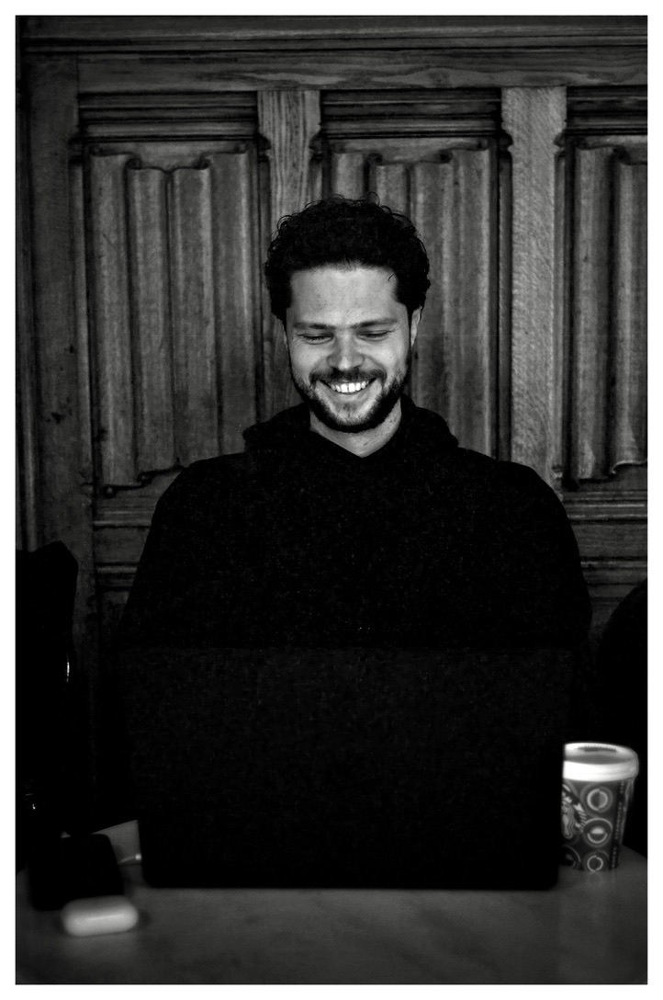

# Ihor Katkov

Check out my GitHub Pages at [ihorkatkov.github.io](https://ihorkatkov.github.io)

---

## About Me

Hey there. I’m Ihor, an AI-native product builder and software engineer with over a decade of experience in software development. I help founders, teams, and companies design, ship, and scale AI-native products, and advise on practical AI transformations.

## Current Work

I'm a Founding Engineer at [Neno](https://neno.co), building AI-powered financial services for European SMEs.

## Research Interests / Expertise

* AI-native products
* AI agents
* Fintech infrastructure
* Software engineering
* Entrepreneurship
